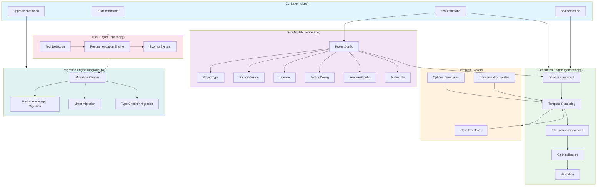
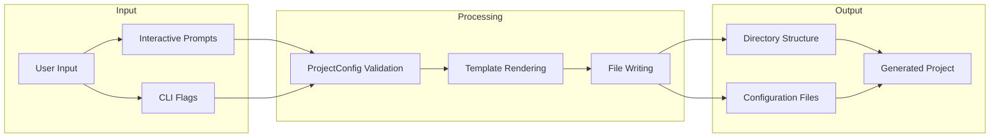

# Architecture Overview

## System Architecture Diagram



## Data Flow Diagram



## Key Architectural Decisions

### 1. Typer for CLI Framework

I chose Typer over alternatives like Click or argparse for several reasons:

- **Type hint integration**: Typer infers CLI options directly from Python type annotations, reducing boilerplate
- **Rich integration**: Built-in support for beautiful terminal output via Rich library
- **Automatic help generation**: Help text is generated from docstrings and type hints
- **Modern Python patterns**: Leverages Python 3.9+ features naturally

### 2. Pydantic for Data Validation

I use Pydantic models throughout the application for configuration management:

- **Runtime validation**: User input is validated immediately with clear error messages
- **Computed properties**: Complex logic like `package_name` derivation is encapsulated in the model
- **Serialization**: Easy conversion between TOML, JSON, and Python objects
- **Type safety**: Full IDE support and static type checking compatibility

### 3. Jinja2 Template System

I selected Jinja2 for template rendering because:

- **Mature ecosystem**: Well-documented with extensive community support
- **Conditional rendering**: Templates can include logic for project-type-specific content
- **Maintainability**: Separating templates from code makes them easier to update
- **Familiarity**: Most Python developers already know Jinja2 syntax

### 4. Pipeline Architecture for Generation

The generator follows a sequential pipeline pattern:

```
Validate -> Create Dirs -> Render Templates -> Write Files -> Init Git -> Validate Output
```

This design provides:

- **Atomicity**: If any step fails, cleanup removes partial work
- **Debuggability**: Each step can be tested independently
- **Extensibility**: New steps can be inserted without modifying existing ones

### 5. Detection-Based Auditing

The auditor uses file-based detection rather than requiring explicit configuration:

- **Zero configuration**: Works on any Python project without setup
- **Multiple signals**: Checks lock files, config files, and tool sections in pyproject.toml
- **Graceful degradation**: Unknown projects get generic recommendations

### 6. Comment-Preserving TOML Manipulation

I use `tomlkit` instead of `tomli` for writing TOML files during upgrades:

- **Preserves comments**: User's existing documentation in pyproject.toml is maintained
- **Maintains formatting**: Whitespace and structure remain intact
- **Safer migrations**: Less risk of destroying important configuration

### 7. Modular Feature System

Features like Docker, GitHub Actions, and VS Code settings are modular add-ons:

- **Optional by default**: Core functionality doesn't depend on optional features
- **Post-creation addition**: Features can be added to existing projects via `quickforge add`
- **Independent templates**: Each feature has its own template set

## Module Responsibilities

| Module | Responsibility |
|--------|---------------|
| `cli.py` | Command definitions, argument parsing, interactive prompts, output formatting |
| `models.py` | Data validation, configuration structure, computed properties, serialization |
| `generator.py` | Directory creation, template rendering, file writing, git initialization |
| `auditor.py` | Tool detection, configuration analysis, recommendation generation, scoring |
| `upgrader.py` | Migration planning, TOML manipulation, tool-specific migration logic |
| `templates/` | Jinja2 templates for all generated files |

## Error Handling Strategy

I implemented defensive error handling throughout:

1. **CLI level**: Catch exceptions and display user-friendly messages
2. **Generator level**: Clean up partial work on failure
3. **Validation level**: Provide specific error messages for invalid input
4. **Upgrade level**: Create backups before making changes
